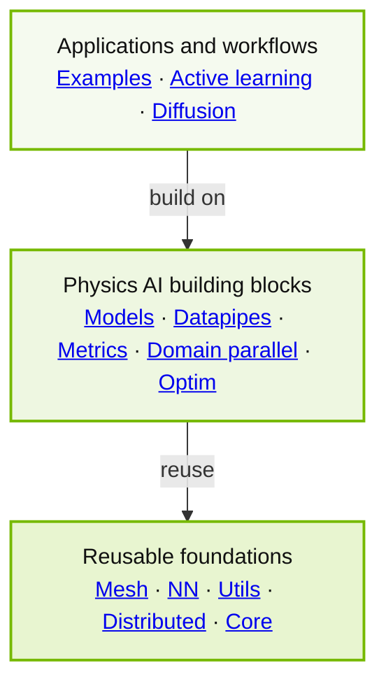

<!-- markdownlint-disable MD002 MD013 MD033 MD041 -->
<h1 align="center">NVIDIA PhysicsNeMo</h1>

<p align="center">
  <strong>Build, train, and scale physics AI models with PyTorch.</strong>
</p>

<div align="center">
  <a href="https://pypi.org/project/nvidia-physicsnemo/"></a>
  <a href="https://pepy.tech/projects/nvidia-physicsnemo"></a>
  <a href="https://docs.nvidia.com/physicsnemo/latest/"></a>
  <a href="https://github.com/NVIDIA/physicsnemo/actions/workflows/install-ci.yml"></a>
  <a href="https://app.codecov.io/gh/NVIDIA/physicsnemo"></a>
  <a href="https://github.com/NVIDIA/physicsnemo/blob/main/LICENSE.txt"></a>
</div>

<p align="center">
  <a href="https://docs.nvidia.com/physicsnemo/latest/">Documentation</a> ·
  <a href="https://github.com/NVIDIA/physicsnemo/blob/main/examples/README.md">Examples</a> ·
  <a href="https://docs.nvidia.com/physicsnemo/latest/physicsnemo/api_models.html">Models</a> ·
  <a href="https://nvidia.github.io/physicsnemo/blog/">Blog</a> ·
  <a href="https://github.com/NVIDIA/physicsnemo/discussions">Discussions</a> ·
  <a href="https://github.com/NVIDIA/physicsnemo/blob/main/CONTRIBUTING.md">Contributing</a>
</p>
<!-- markdownlint-enable MD013 MD033 MD041 -->

NVIDIA PhysicsNeMo is an open-source PyTorch framework for physics machine learning
(physics ML), scientific machine learning (SciML), and AI for science and engineering.
It provides reusable library components and end-to-end training recipes.

<!-- Keep repository links absolute because this README is also rendered on PyPI. -->

```bash
pip install "nvidia-physicsnemo[cu13]"
```

For CUDA 12, a basic install, optional features, or source setup, refer to
[installation options](#installation-options).

## PhysicsNeMo in Action

<!-- markdownlint-disable MD013 MD033 -->
<table width="100%">
  <tr>
    <th width="50%" align="center">Aerodynamics</th>
    <th width="50%" align="center">Weather Forecasting</th>
  </tr>
  <tr>
    <td width="50%" align="center"><a href="https://github.com/NVIDIA/physicsnemo/tree/main/examples/cfd/external_aerodynamics/active_learning_aero"></a></td>
    <td width="50%" align="center"><a href="https://github.com/NVIDIA/physicsnemo/tree/main/examples/weather/stormcast"></a></td>
  </tr>
  <tr>
    <td width="50%" align="center" valign="top"><a href="https://github.com/NVIDIA/physicsnemo/tree/main/examples/cfd/external_aerodynamics/unified_external_aero_recipe"><strong>Unified external aerodynamics</strong></a>: train and compare current surface and volume models</td>
    <td width="50%" align="center" valign="top"><a href="https://github.com/NVIDIA/physicsnemo/tree/main/examples/weather/stormcast"><strong>StormCast</strong></a>: generative regional weather forecasting</td>
  </tr>
  <tr>
    <th width="50%" align="center">Semiconductor packaging</th>
    <th width="50%" align="center">Structural mechanics</th>
  </tr>
  <tr>
    <td width="50%" align="center"><a href="https://github.com/NVIDIA/physicsnemo/tree/main/examples/cfd/underfill_dispensing"></a></td>
    <td width="50%" align="center"><a href="https://github.com/NVIDIA/physicsnemo/tree/main/examples/structural_mechanics/crash"></a></td>
  </tr>
  <tr>
    <td width="50%" align="center" valign="top"><a href="https://github.com/NVIDIA/physicsnemo/tree/main/examples/cfd/underfill_dispensing"><strong>Underfill dispensing</strong></a>: transient epoxy-interface prediction with GeoTransolver</td>
    <td width="50%" align="center" valign="top"><a href="https://github.com/NVIDIA/physicsnemo/tree/main/examples/structural_mechanics/crash"><strong>Crash dynamics</strong></a>: transient surrogates on deforming meshes</td>
  </tr>
  <tr>
    <th width="50%" align="center">Geophysics</th>
    <th width="50%" align="center">Healthcare</th>
  </tr>
  <tr>
    <td width="50%" align="center"><a href="https://github.com/NVIDIA/physicsnemo/tree/main/examples/geophysics/diffusion_fwi"></a></td>
    <td width="50%" align="center"><a href="https://github.com/NVIDIA/physicsnemo/tree/main/examples/healthcare/bloodflow_1d_mgn"></a></td>
  </tr>
  <tr>
    <td width="50%" align="center" valign="top"><a href="https://github.com/NVIDIA/physicsnemo/tree/main/examples/geophysics/diffusion_fwi"><strong>Diffusion FWI</strong></a>: guided generative full-waveform inversion</td>
    <td width="50%" align="center" valign="top"><a href="https://github.com/NVIDIA/physicsnemo/tree/main/examples/healthcare/bloodflow_1d_mgn"><strong>Cardiovascular flow</strong></a>: reduced-order prediction with MeshGraphNet</td>
  </tr>
  <tr>
    <th width="50%" align="center">Data-center thermal design</th>
    <th width="50%" align="center">Additive manufacturing</th>
  </tr>
  <tr>
    <td width="50%" align="center"><a href="https://github.com/NVIDIA/physicsnemo/tree/main/examples/cfd/datacenter"></a></td>
    <td width="50%" align="center"><a href="https://github.com/NVIDIA/physicsnemo/tree/main/examples/additive_manufacturing/sintering_physics"></a></td>
  </tr>
  <tr>
    <td width="50%" align="center" valign="top"><a href="https://github.com/NVIDIA/physicsnemo/tree/main/examples/cfd/datacenter"><strong>Data-center airflow</strong></a>: real-time temperature and airflow prediction with a 3D U-Net surrogate</td>
    <td width="50%" align="center" valign="top"><a href="https://github.com/NVIDIA/physicsnemo/tree/main/examples/additive_manufacturing/sintering_physics"><strong>Metal sintering</strong></a>: graph-based deformation prediction</td>
  </tr>
</table>
<!-- markdownlint-enable MD013 MD033 -->

Every visual above comes from a PhysicsNeMo recipe or workflow.

## Why PhysicsNeMo

- **PyTorch-native and composable.** Use a complete architecture, a layer, a numerical
  operator, or a data transform without replacing your existing PyTorch workflow.
- **Built for scientific representations.** Work with regular grids, meshes, point
  clouds, graphs, and nested physical fields while preserving their structure.
- **Scale the sample itself.** Use `ShardTensor` domain parallelism to split a single
  high-resolution sample across GPUs, alongside PyTorch DistributedDataParallel (DDP) or
  Fully Sharded Data Parallel 2 (FSDP2).

## Explore Recipes

Start from a recipe and adapt it to your data, geometry, physics, and deployment
constraints. Explore by physical domain:

- ✈️ **Engineering design and CFD:** train and compare current surface and volume
  models with the
  [unified external-aerodynamics recipe](https://github.com/NVIDIA/physicsnemo/tree/main/examples/cfd/external_aerodynamics/unified_external_aero_recipe)
  or accelerate [data-center airflow](https://github.com/NVIDIA/physicsnemo/tree/main/examples/cfd/datacenter).
- 🌦️ **Weather, climate, and water:** build global forecasts from the
  [weather recipes](https://github.com/NVIDIA/physicsnemo/tree/main/examples/weather)
  or predict [floods](https://github.com/NVIDIA/physicsnemo/tree/main/examples/weather/flood_modeling).
- 🏗️ **Structures and manufacturing:** emulate
  [deforming structures](https://github.com/NVIDIA/physicsnemo/tree/main/examples/structural_mechanics/deforming_plate).
- 🌍 **Geophysics and subsurface systems:** build
  [reservoir surrogates](https://github.com/NVIDIA/physicsnemo/tree/main/examples/reservoir_simulation).
- 🫀 **Healthcare:** perform
  [brain anomaly detection](https://github.com/NVIDIA/physicsnemo/tree/main/examples/healthcare/brain_anomaly_detection).
- ✨ **Generative and inverse physics:** compose the
  [diffusion toolkit](https://docs.nvidia.com/physicsnemo/latest/physicsnemo/api_diffusion.html)
  with [topology-generation recipes](https://github.com/NVIDIA/physicsnemo/tree/main/examples/generative/topodiff).
- 🔁 **Simulation-data loops:** select new simulations with
  [active learning](https://github.com/NVIDIA/physicsnemo/tree/main/examples/active_learning).

Browse the [complete example catalog](https://github.com/NVIDIA/physicsnemo/blob/main/examples/README.md)
for every available recipe.

### Explore the PhysicsNeMo Ecosystem

PhysicsNeMo supplies reusable models, training components, and recipes. For a
domain-focused application layer or data preparation, continue with:

| Need | Continue with |
| --- | --- |
| **Scientific data preparation** | [PhysicsNeMo Curator](https://github.com/NVIDIA/physicsnemo-curator) for extract, transform, and load (ETL) pipelines that prepare AI-ready scientific and engineering datasets |
| **Engineering inference and design** | [PhysicsNeMo CFD](https://github.com/NVIDIA/physicsnemo-cfd) for inference, evaluation, benchmarking, and design workflows |
| **Weather and climate** | [Earth2Studio](https://github.com/NVIDIA/earth2studio) for building and deploying AI weather and climate workflows |
| **Atomistic simulation** | [NVIDIA ALCHEMI Toolkit](https://github.com/NVIDIA/nvalchemi-toolkit) for GPU-first training, inference, and dynamics workflows, with optimized primitives from [ALCHEMI Toolkit Ops](https://github.com/NVIDIA/nvalchemi-toolkit-ops) |

## Choose a Model Family

PhysicsNeMo models are ordinary `torch.nn.Module` objects. Choose a family by the
representation of your data and the task you need to solve. Model names link to source
code. The final column links to examples and papers.

### Surrogates and Dynamics

| Model family | Data representation | Known uses and starting points |
| --- | --- | --- |
| [FNO](https://github.com/NVIDIA/physicsnemo/tree/main/physicsnemo/models/fno) / [DPOT](https://github.com/NVIDIA/physicsnemo/tree/main/physicsnemo/models/dpot) | Regular Cartesian grids; DPOT adds a time/history axis | Neural PDE operators and autoregressive dynamics: [Darcy flow with FNO](https://github.com/NVIDIA/physicsnemo/tree/main/examples/cfd/darcy_fno), [DPOT paper](https://arxiv.org/abs/2403.03542) |
| [MeshGraphNet](https://github.com/NVIDIA/physicsnemo/tree/main/physicsnemo/models/meshgraphnet) / [VFGN](https://github.com/NVIDIA/physicsnemo/tree/main/physicsnemo/models/vfgn) | Node-edge graphs over unstructured meshes | Mesh dynamics and reduced-order simulation: [vehicle crash](https://github.com/NVIDIA/physicsnemo/tree/main/examples/structural_mechanics/crash), [cardiovascular flow](https://github.com/NVIDIA/physicsnemo/tree/main/examples/healthcare/bloodflow_1d_mgn), [metal sintering](https://github.com/NVIDIA/physicsnemo/tree/main/examples/additive_manufacturing/sintering_physics) |
| [Transolver](https://github.com/NVIDIA/physicsnemo/tree/main/physicsnemo/models/transolver) / [FLARE](https://github.com/NVIDIA/physicsnemo/tree/main/physicsnemo/models/flare) | Point sets and structured or unstructured discretizations | PDE surrogates on large discretizations: [Darcy flow](https://github.com/NVIDIA/physicsnemo/tree/main/examples/cfd/darcy_transolver), [external aerodynamics](https://github.com/NVIDIA/physicsnemo/tree/main/examples/cfd/external_aerodynamics/unified_external_aero_recipe) |
| [GeoTransolver](https://github.com/NVIDIA/physicsnemo/tree/main/physicsnemo/models/geotransolver) | Point clouds or structured/unstructured grids, with geometry and global context | Geometry-aware CAE: [external aerodynamics](https://github.com/NVIDIA/physicsnemo/tree/main/examples/cfd/external_aerodynamics/unified_external_aero_recipe), [underfill dispensing](https://github.com/NVIDIA/physicsnemo/tree/main/examples/cfd/underfill_dispensing) |
| [DoMINO](https://github.com/NVIDIA/physicsnemo/tree/main/physicsnemo/models/domino) | Geometry points, sampled surface/volume fields, and structured SDF grids | Surface and volume field prediction for automotive aerodynamics: [paper](https://arxiv.org/abs/2501.13350) |
| [FIGConvNet](https://github.com/NVIDIA/physicsnemo/tree/main/physicsnemo/models/figconvnet) | Large 3D point clouds represented with factorized 2D grids | 3D CAE field and scalar prediction: [external aerodynamics](https://github.com/NVIDIA/physicsnemo/tree/main/examples/cfd/external_aerodynamics/figconvnet), [vehicle crash](https://github.com/NVIDIA/physicsnemo/tree/main/examples/structural_mechanics/crash) |
| [GLOBE](https://github.com/NVIDIA/physicsnemo/tree/main/physicsnemo/experimental/models/globe) *(experimental; API may change)* | Boundary meshes and arbitrary query points | Boundary-driven PDEs and large-geometry CAE: [external aerodynamics](https://github.com/NVIDIA/physicsnemo/tree/main/examples/cfd/external_aerodynamics/unified_external_aero_recipe), [paper](https://arxiv.org/abs/2511.15856) |
| [AeroJEPA](https://github.com/NVIDIA/physicsnemo/tree/main/physicsnemo/experimental/models/aerojepa) *(experimental; API may change)* | 3D surface point clouds, operating conditions, and query points | Aerodynamic representation learning and field prediction: [tutorial](https://github.com/NVIDIA/physicsnemo/tree/main/examples/cfd/external_aerodynamics/aerojepa), [paper](https://arxiv.org/abs/2605.05586) |

### Weather and Climate

| Model family | Data representation | Known uses and starting points |
| --- | --- | --- |
| [AFNO](https://github.com/NVIDIA/physicsnemo/tree/main/physicsnemo/models/afno) | Regular 2D fields | Global forecasting: [unified weather recipe](https://github.com/NVIDIA/physicsnemo/tree/main/examples/weather/unified_recipe) |
| [GraphCast](https://github.com/NVIDIA/physicsnemo/tree/main/physicsnemo/models/graphcast) | Latitude-longitude fields and a multiscale icosahedral mesh graph | Global autoregressive forecasting: [recipe](https://github.com/NVIDIA/physicsnemo/tree/main/examples/weather/graphcast), [paper](https://arxiv.org/abs/2212.12794) |
| [Pangu-Weather](https://github.com/NVIDIA/physicsnemo/tree/main/physicsnemo/models/pangu) / [FengWu](https://github.com/NVIDIA/physicsnemo/tree/main/physicsnemo/models/fengwu) | Multilevel latitude-longitude grids | Global medium-range forecasting: [Pangu-Weather recipe](https://github.com/NVIDIA/physicsnemo/tree/main/examples/weather/pangu_weather), [FengWu paper](https://arxiv.org/abs/2304.02948) |
| [DLWP](https://github.com/NVIDIA/physicsnemo/tree/main/physicsnemo/models/dlwp) / [DLWP-HEALPix](https://github.com/NVIDIA/physicsnemo/tree/main/physicsnemo/models/dlwp_healpix) | Cubed-sphere grids or HEALPix meshes | Global and coupled forecasting: [DLWP](https://github.com/NVIDIA/physicsnemo/tree/main/examples/weather/dlwp), [DLWP-HEALPix](https://github.com/NVIDIA/physicsnemo/tree/main/examples/weather/dlwp_healpix) |

### Generative and Inverse Models

| Model family | Data representation | Known uses and starting points |
| --- | --- | --- |
| [Diffusion U-Nets](https://github.com/NVIDIA/physicsnemo/tree/main/physicsnemo/models/diffusion_unets) / [DiT](https://github.com/NVIDIA/physicsnemo/tree/main/physicsnemo/models/dit) | 2D fields or patch tokens | Stochastic regional forecasting, downscaling, and inverse problems: [StormCast and StormScope](https://github.com/NVIDIA/physicsnemo/tree/main/examples/weather/stormcast), [diffusion FWI](https://github.com/NVIDIA/physicsnemo/tree/main/examples/geophysics/diffusion_fwi) |
| [TopoDiff](https://github.com/NVIDIA/physicsnemo/tree/main/physicsnemo/models/topodiff) | 2D topology fields conditioned on design constraints | Generative topology optimization: [recipe](https://github.com/NVIDIA/physicsnemo/tree/main/examples/generative/topodiff), [paper](https://arxiv.org/abs/2208.09591) |

Refer to the [model catalog](https://docs.nvidia.com/physicsnemo/latest/physicsnemo/api_models.html)
for the full API and configuration details.

## Contents of PhysicsNeMo

The framework is layered so high-level workflows can reuse lower-level scientific
building blocks without forcing those foundations to depend on applications.

<!-- markdownlint-disable MD013 -->

<!-- markdownlint-enable MD013 -->

Arrows follow the allowed dependency direction in the
[import-layer contract](https://github.com/NVIDIA/physicsnemo/blob/main/.importlinter).
The diagram is simplified. Follow the links below for the public surfaces.

- **Applications and workflows:** runnable
  [examples](https://github.com/NVIDIA/physicsnemo/tree/main/examples),
  restartable [active-learning loops](https://github.com/NVIDIA/physicsnemo/tree/main/physicsnemo/active_learning),
  and [diffusion](https://github.com/NVIDIA/physicsnemo/tree/main/physicsnemo/diffusion)
  schedulers, samplers, guidance, and multi-diffusion.
- **Physics AI building blocks:** optimized
  [models](https://github.com/NVIDIA/physicsnemo/tree/main/physicsnemo/models),
  [datapipes](https://github.com/NVIDIA/physicsnemo/tree/main/physicsnemo/datapipes)
  for readers, transforms, GPU preprocessing, and multi-dataset sampling,
  [metrics](https://github.com/NVIDIA/physicsnemo/tree/main/physicsnemo/metrics),
  [`ShardTensor` domain parallelism](https://github.com/NVIDIA/physicsnemo/tree/main/physicsnemo/domain_parallel),
  and [optimization](https://github.com/NVIDIA/physicsnemo/tree/main/physicsnemo/optim).
- **Reusable foundations:** [`Mesh` and `DomainMesh`](https://github.com/NVIDIA/physicsnemo/blob/main/physicsnemo/mesh/README.md)
  with GPU topology, spatial queries, remeshing, and differentiable deformation;
  [neural-network layers and numerical functionals](https://github.com/NVIDIA/physicsnemo/tree/main/physicsnemo/nn)
  for derivatives, interpolation, geometry, sampling, and rendering;
  [utilities](https://github.com/NVIDIA/physicsnemo/tree/main/physicsnemo/utils) for
  checkpointing, logging, and profiling;
  [distributed primitives](https://github.com/NVIDIA/physicsnemo/tree/main/physicsnemo/distributed)
  including distributed FFTs;
  and the [model lifecycle core](https://github.com/NVIDIA/physicsnemo/tree/main/physicsnemo/core).

Cross-cutting [deployment helpers](https://github.com/NVIDIA/physicsnemo/tree/main/physicsnemo/deploy)
cover ONNX export and runtime. [Experimental modules](https://github.com/NVIDIA/physicsnemo/tree/main/physicsnemo/experimental)
incubate models such as [GLOBE](https://github.com/NVIDIA/physicsnemo/tree/main/physicsnemo/experimental/models/globe)
and [AeroJEPA](https://github.com/NVIDIA/physicsnemo/tree/main/physicsnemo/experimental/models/aerojepa),
alongside uncertainty quantification, guardrails, parameter-efficient fine-tuning
with LoRA, and other research utilities.

> **API stability:** APIs under `physicsnemo.experimental` are incubating and may change
> between releases. Stable modules follow the project's semantic-versioning policy.
> Refer to the [changelog][api-changelog] for API changes and removals.

[api-changelog]: https://github.com/NVIDIA/physicsnemo/blob/main/CHANGELOG.md

## Use PhysicsNeMo with Coding Agents

The repository includes two NVIDIA-authored skills for Codex, Claude Code, and other
compatible coding agents:

- [PhysicsNeMo Discover](https://github.com/NVIDIA/physicsnemo/blob/main/skills/physicsnemo-discover/SKILL.md)
  finds models, datapipes, examples, and documentation for a SciML task
  ([evaluation](https://github.com/NVIDIA/physicsnemo/blob/main/skills/physicsnemo-discover/BENCHMARK.md)).
- [PhysicsNeMo ShardTensor](https://github.com/NVIDIA/physicsnemo/blob/main/skills/physicsnemo-shard-tensor/SKILL.md)
  helps add domain parallelism, integrate DDP or FSDP2, implement shard-aware
  operations, and write multi-GPU correctness tests
  ([evaluation](https://github.com/NVIDIA/physicsnemo/blob/main/skills/physicsnemo-shard-tensor/BENCHMARK.md)).

## Installation Options

Refer to [`pyproject.toml`](https://github.com/NVIDIA/physicsnemo/blob/main/pyproject.toml)
for currently supported Python versions, optional dependency groups, and exact
dependency constraints. The command at the top of this README selects the CUDA 13
backend. Use the CUDA 12 backend instead with:

```bash
pip install "nvidia-physicsnemo[cu12]"
```

For a basic installation that uses PyPI's default PyTorch distribution and does not
install the CUDA-specific RAPIDS packages:

```bash
pip install nvidia-physicsnemo
```

Optional features compose with either backend, for example:

```bash
pip install "nvidia-physicsnemo[cu13,gnns]"
```

To work from a source checkout with [uv](https://docs.astral.sh/uv/):

```bash
git clone https://github.com/NVIDIA/physicsnemo.git
cd physicsnemo
uv sync --extra cu13
```

## Learning Resources

Learn through the [PhysicsNeMo notebooks on Hugging Face](https://huggingface.co/collections/nvidia/physicsnemo),
the [AI for Science bootcamp](https://github.com/openhackathons-org/End-to-End-AI-for-Science),
and the [self-paced NVIDIA Deep Learning Institute course](https://learn.nvidia.com/courses/course-detail?course_id=course-v1:DLI+S-OV-04+V1).
Pretrained models and datasets are available through the
[NGC catalog](https://catalog.ngc.nvidia.com/search?orderBy=scoreDESC&page=&pageSize=&query=PhysicsNeMo).

## Community and Contributing

Contributions to the library, examples, and documentation are welcome.

- Ask questions and share work in [GitHub Discussions](https://github.com/NVIDIA/physicsnemo/discussions).
- Report a bug or propose a feature through [GitHub Issues](https://github.com/NVIDIA/physicsnemo/issues).
- Look for issues labeled [help wanted](https://github.com/NVIDIA/physicsnemo/issues?q=is%3Aissue+is%3Aopen+label%3A%22help+wanted%22).
- **Before opening a pull request, read the
  [contribution guide](https://github.com/NVIDIA/physicsnemo/blob/main/CONTRIBUTING.md)
  and coordinate the proposed work with maintainers in an issue or discussion.**
  Every pull request should correspond to an open issue. For substantial changes,
  wait for maintainer feedback before starting implementation.
- Follow the [code of conduct](https://github.com/NVIDIA/physicsnemo/blob/main/CODE_OF_CONDUCT.MD),
  and report vulnerabilities privately through the
  [security policy](https://github.com/NVIDIA/physicsnemo/blob/main/SECURITY.md).

For release history and upgrade notes, refer to the
[changelog](https://github.com/NVIDIA/physicsnemo/blob/main/CHANGELOG.md),
[GitHub releases](https://github.com/NVIDIA/physicsnemo/releases), and the
[v2 migration guide](https://github.com/NVIDIA/physicsnemo/blob/main/v2.0-MIGRATION-GUIDE.md).

## Citation

If PhysicsNeMo supports your research, cite the project using the metadata in
[CITATION.cff](https://github.com/NVIDIA/physicsnemo/blob/main/CITATION.cff). Work that
uses PhysicsNeMo domain parallelism should also cite
[*ShardTensor: Domain Parallelism for Scientific Machine Learning*](https://arxiv.org/abs/2605.11111).

## Share Your Research

Publishing a paper that uses PhysicsNeMo? Add it to our
[Research and Publications Using PhysicsNeMo](https://github.com/NVIDIA/physicsnemo/blob/main/docs/research.md)
page so the community can find it. Open a
[research paper submission](https://github.com/NVIDIA/physicsnemo/issues/new?template=research_paper.yml)
with your paper's details, or edit
[`docs/research.md`](https://github.com/NVIDIA/physicsnemo/blob/main/docs/research.md)
directly and open a pull request.

## License

PhysicsNeMo is licensed under the
[Apache License 2.0](https://github.com/NVIDIA/physicsnemo/blob/main/LICENSE.txt).
