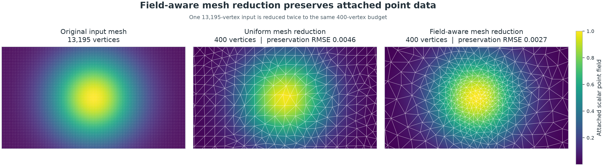
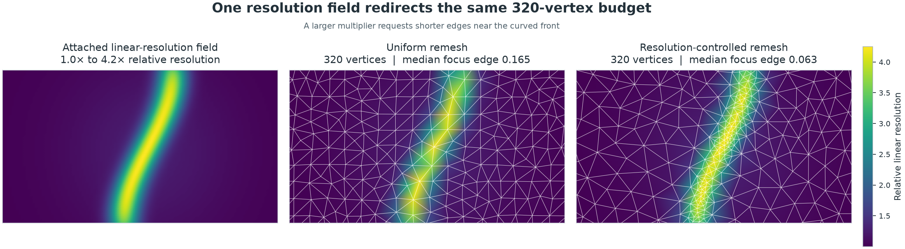
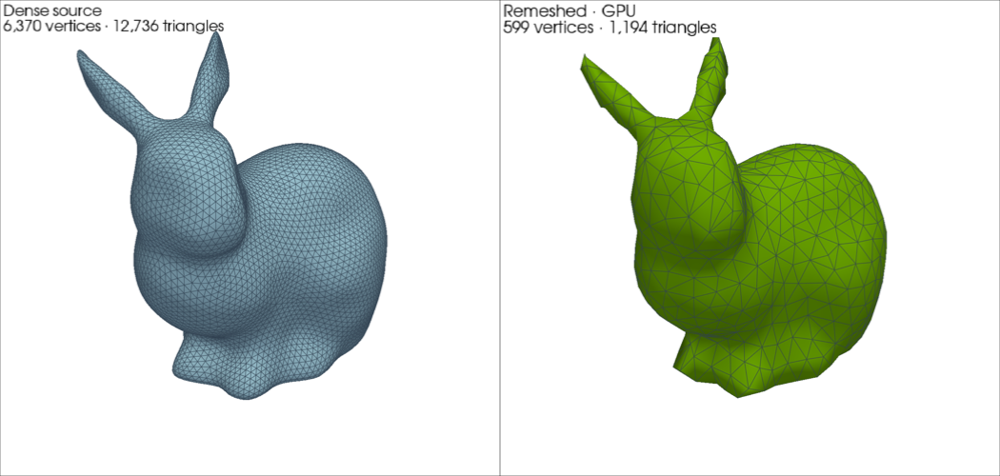
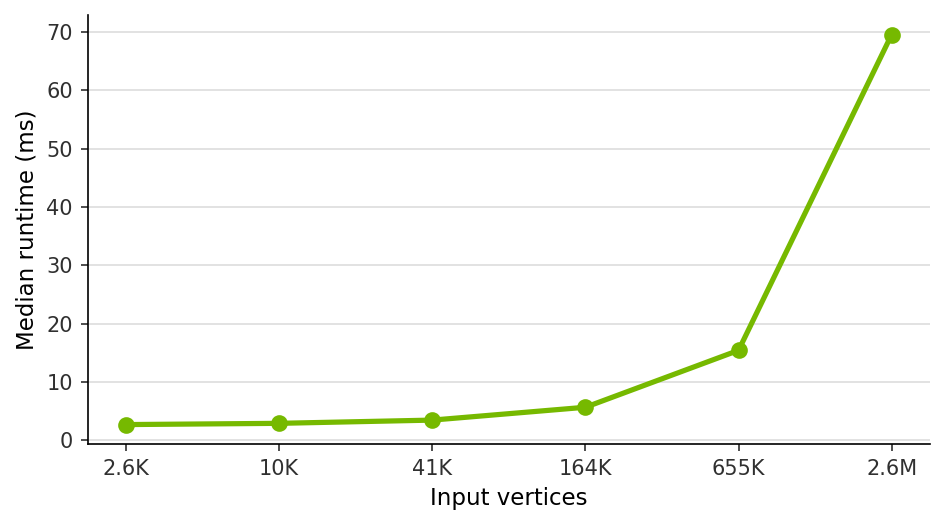

Remeshing
=========

.. currentmodule:: physicsnemo.mesh.remeshing

PhysicsNeMo provides Warp-based surface remeshing on CPU and CUDA for 2D
triangle manifolds embedded in 3D. ``n_clusters`` is the global target number
of output vertices, not triangles. Cleanup can produce slightly fewer
vertices.

Remeshing can barycentrically interpolate selected ``point_data`` onto the new
vertices. A direct positive scalar tensor or an attached point-data field can
also specify relative linear resolution within the fixed vertex budget. Cell
data is discarded. Global data, point dtype, and device are preserved.

CPU and CUDA Example
--------------------

The output remains on the input device. The example below selects CUDA when it
is available and otherwise runs on CPU. The equivalent
:meth:`~physicsnemo.mesh.Mesh.remesh` convenience method accepts the same
high-level remeshing controls:

.. code:: python

   import torch

   from physicsnemo.mesh.primitives.surfaces import sphere_icosahedral
   from physicsnemo.mesh.remeshing import remesh

   device = "cuda" if torch.cuda.is_available() else "cpu"
   dense = sphere_icosahedral.load(subdivisions=6, device=device)
   coarse = remesh(dense, n_clusters=4_096)

   assert coarse.points.device == dense.points.device
   assert 0 < coarse.n_points <= 4_096

Transfer Point Data
-------------------

Set ``transfer_point_data`` to a key, a nested key path, or a list of keys and
paths. ``True`` selects every point-data leaf. Selected fields must contain
real floating-point tensors:

.. code:: python

   dense.point_data["temperature"] = dense.points[:, 2]
   dense.point_data["flow", "pressure"] = dense.points[:, 0].square()

   coarse = dense.remesh(
       n_clusters=4_096,
       transfer_point_data=[
           "temperature",
           ("flow", "pressure"),
       ],
   )

   assert "temperature" in coarse.point_data
   assert ("flow", "pressure") in coarse.point_data.keys(
       include_nested=True,
       leaves_only=True,
   )

Warp records the closest source triangle and barycentric coordinates while it
projects each final output vertex. PyTorch then interpolates the selected
fields directly from the original mesh. This avoids a second spatial query and
prevents cumulative interpolation drift.

Transfer does not improve the source field or recover details that are absent
from the input mesh. A reduced mesh has fewer degrees of freedom and generally
loses some field information. Resolution control can reduce that loss by
placing more of the fixed output budget where the attached field varies most.

The geometry, topology, source-triangle selection, and barycentric weights are
non-differentiable. The interpolation remains differentiable with respect to
the source field values. This is nodal interpolation, not a conservative
remap. It does not guarantee preservation of a field integral or mean.

The figure shows one input mesh and two reductions of its attached scalar
field. The field is one smooth sphere-like bump at the mesh center. The center
panel uses uniform remeshing. The right panel uses a 1× to 4× resolution
request derived from the field magnitude. Both reductions use the same
400-vertex output budget. Preservation RMSE compares each reduced
piecewise-linear field with the input piecewise-linear field on a shared grid
subset.

Control Local Resolution
------------------------

Pass a positive scalar tensor directly as ``resolution_field``, or store it in
``point_data`` and pass its key. Its values are relative linear-resolution
multipliers. A value twice another requests approximately half the local edge
spacing. The field must use a real floating-point dtype on the mesh device:

.. code:: python

   x = dense.points[:, 0]
   resolution = 1.0 + 2.0 * torch.exp(
       -((x - 0.25) / 0.08).square()
   )

   adaptive = dense.remesh(
       n_clusters=4_096,
       resolution_field=resolution,
       transfer_point_data=["temperature"],
   )

Direct tensor entries correspond to ``dense.points`` order. Passing the tensor
does not attach it to either mesh or transfer it to the output. Passing a
``point_data`` key remains useful when the field is already attached.

Only relative values matter. Multiplying the entire resolution field by a
positive constant leaves the remeshing objective unchanged. The values are
relative inverse edge lengths, not exact edge lengths or guaranteed local
vertex counts. For the 2D squared-distance CVT objective, the implementation
converts linear resolution ``r`` to integration density ``r**4``. Ideal local
point density therefore scales approximately as ``r**2``. A constant field
follows the uniform remeshing path. ``n_clusters`` remains the global budget.

A resolution field can encode a region of interest, a solver error indicator,
or an importance field derived from physical point data. The second figure
shows the same output budget with and without this control:

Warp Tuning
-----------

Advanced users can tune the backend search and initialization policy through
the tensor functional. These backend-specific parameters may change as the
implementation evolves:

.. code:: python

   from physicsnemo.nn.functional import remeshing

   linear_resolution = resolution
   if linear_resolution.element_size() < 4:
       linear_resolution = linear_resolution.to(torch.float32)
   normalized_resolution = linear_resolution / linear_resolution.amax()
   tuned_points, tuned_cells = remeshing(
       dense.points,
       dense.cells,
       n_clusters=4_096,
       vertex_density=normalized_resolution.pow(4),
       search_radius_scale=2.0,
       voxel_width_scale=1.0,
       hash_grid_resolution=192,
       farthest_point_threshold=512,
       farthest_point_oversampling=6,
   )

These values are host-side controls or runtime kernel arguments. Changing them
reuses the compiled Warp kernels rather than triggering JIT recompilation.

The tensor functional accepts raw CVT integration density through
``vertex_density``. It does not interpret that tensor as linear resolution.
Promote values smaller than ``float32``, then normalize before raising the field
to the fourth power. This follows the conversion order used by ``Mesh.remesh``
and avoids overflowing reduced-precision inputs.

The Warp implementation uses centroidal relaxation with a hash grid. Uniform
remeshing uses lumped vertex area as integration mass. Adaptive remeshing
multiplies that mass by ``vertex_density``. Density-aware initialization biases
seeds toward the ideal 2D generator density. Large uniform targets retain the
baseline spatially uniform voxel selection. Adaptive remeshing also enlarges
the hash-grid query radius when needed to cover the wider spacing requested in
low-density regions.

Warp projects relaxed vertices onto the source surface using a bounding volume
hierarchy (BVH), removes collapsed and duplicate faces, and compacts unused
vertices. Small targets use farthest-point initialization for mesh quality.
Large uniform targets use a linearithmic spatially stratified initializer.
Large adaptive targets sample directly from the requested generator density.
Both paths avoid quadratic setup cost.

Performance
-----------

The checked-in ASV benchmark measures warmed, end-to-end GPU execution:

- clustering
- surface projection
- topology reconstruction
- cleanup
- optional scalar-field interpolation
- optional linear-resolution-field conversion

Timing includes an explicit CUDA synchronization.

On supported CUDA devices, remeshing can be up to 300× faster than a CPU
baseline.

.. code:: console

   ./benchmarks/run_benchmarks.sh -b remesh

The figure below is a representative run of
``docs/img/mesh/remeshing_performance.py`` on an NVIDIA RTX PRO 6000 Blackwell
Server Edition MIG 1g.24GB partition using Warp 1.14.0. Absolute timings depend
on hardware and software versions. Use the ASV benchmark above for measurements
in another environment.

Behavior and Limitations
------------------------

* Remeshing is non-differentiable. The implementation centers and scales
  geometry before computing in ``float32``, then restores the input coordinate
  frame and point dtype on return. Resolution fields are detached before they
  affect clustering.
* Barycentric point-data transfer supports real floating-point tensors. It
  preserves trailing component dimensions and the source field dtype.
  Dtypes smaller than ``float32`` accumulate in ``float32`` before conversion
  back to the source dtype. Categorical integer, Boolean, and complex fields
  are not interpolated.
* Point-data transfer requires a valid closest source triangle for every
  output vertex. A surface feature that is numerically degenerate in the
  float32 Warp projection can still remesh geometrically, but field transfer
  raises ``RuntimeError`` when its source-triangle provenance is unavailable.
* Warp floating-point atomics can introduce small run-to-run differences in
  vertex positions and, near assignment ties, topology, even though centroid
  sampling uses a fixed random seed. Do not rely on bitwise reproducibility.
* Because clustering uses spatial distance rather than mesh connectivity,
  sheets or thin features separated by less than the mean cluster spacing can
  be assigned to a common cluster and welded together.
* Projection can map distinct cluster centroids to the same surface position.
  Output vertices are compacted by connectivity but are not welded by
  position.
* Open boundary vertices are not constrained. Centroid relaxation and
  projection can move the reconstructed boundary inward from the source
  boundary.
* Strong resolution contrast can leave too few vertices in low-resolution
  regions. The fourth-power conversion intentionally amplifies linear
  resolution ratios.
  Use moderate resolution ratios and validate the resulting topology and field
  error for the application.
* The optional ``max_iterations`` argument defaults to four centroid updates.

API Reference
-------------

.. automodule:: physicsnemo.mesh.remeshing
   :members:
   :show-inheritance:
