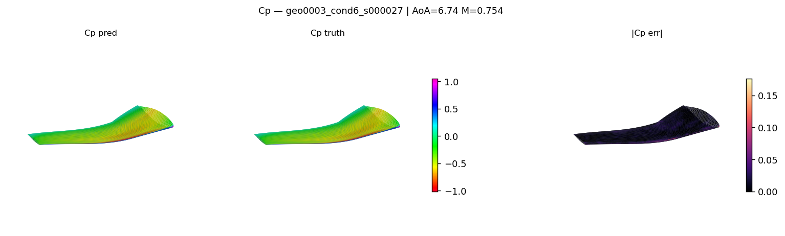
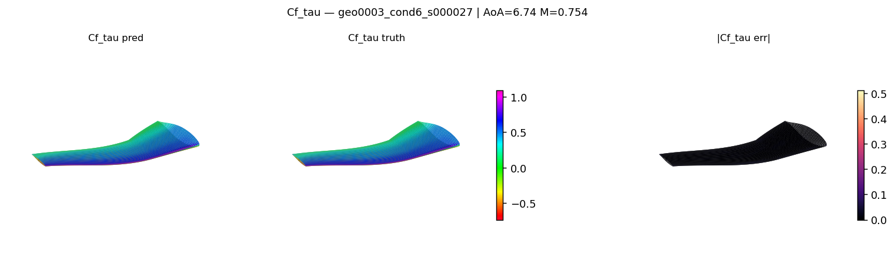
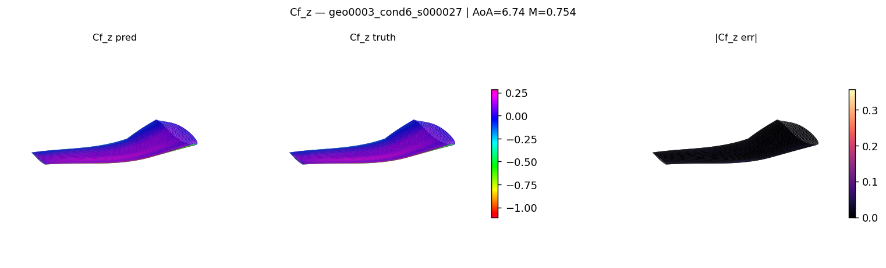
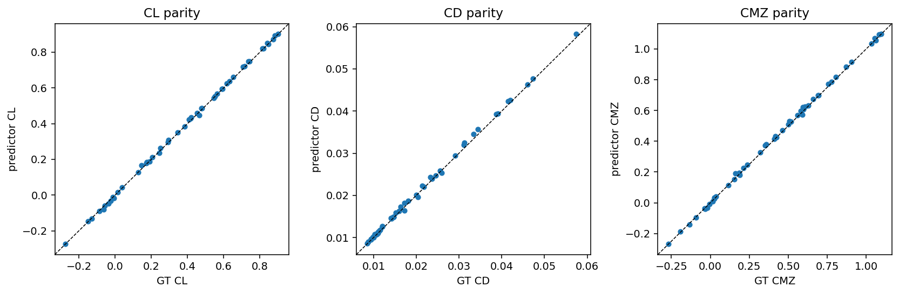

<!-- markdownlint-disable MD013 MD033 -->

# AeroJEPA — Tutorial Recipe

This example trains and evaluates the
[AeroJEPA](https://arxiv.org/abs/2605.05586) (Giral et al.) model on the **SuperWing**
3D aerodynamic dataset.

AeroJEPA is a Joint-Embedding Predictive Architecture. Rather than mapping geometry directly to a flow field, it predicts a latent representation of the flow from a latent representation of the geometry and operating conditions, and reconstructs the field through a continuous implicit decoder when needed. This recipe walks through the full workflow, from dataset download through training, inference, and CL/CD estimation.

> SuperWing is a more tutorial-friendly dataset (a parametric wing
> family at varying angle of attack and mach number).

## Tutorial Process  

1. [Setup](#1-setup)
2. [Get the SuperWing dataset](#2-get-the-superwing-dataset)
3. [Train](#3-train)
4. [Inference and field plots](#4-inference-and-field-plots)
5. [Field-accuracy metrics](#5-field-accuracy-metrics)
6. [CL, CD and CM estimation](#6-cl-cd-and-cm-estimation)
7. [Adding a new dataset](#7-adding-a-new-dataset)

---

## 1. Setup

The [`requirements.txt`](requirements.txt) file lists the additional dependencies for this example, including Hugging Face Hub for dataset download and utilities for plotting and post-processing.

```bash
# Inside an environment with physicsnemo installed:
pip install -r requirements.txt
```

### Optional acceleration backends

The recipe uses standard PyTorch layers by default. Transformer Engine is listed
in `requirements.txt` so it is available as an opt-in acceleration backend; enable
it consistently across the context encoder, target encoder, decoder, and predictor
with the single Hydra override:

```bash
python train.py data.path=/path/to/SuperWing_Dataset use_te=true
```

Use the same `use_te` setting when loading a checkpoint for inference.

AeroJEPA leaves k-nearest-neighbor backend selection to PhysicsNeMo. For CUDA
tensors, PhysicsNeMo uses RAPIDS cuML (with CuPy) when both are installed. If
they are unavailable, it emits a one-time warning and falls back to the PyTorch
implementation, so RAPIDS is not required to build or run this example. Install
PhysicsNeMo with the matching `cu12` or `cu13` extra if you want the accelerated
cuML path, for example:

```bash
pip install "nvidia-physicsnemo[cu13]"
```

On CPU, PhysicsNeMo prefers SciPy when available and otherwise falls back to
PyTorch.

## 2. Get the SuperWing Dataset

The dataset lives on the Hugging Face Hub at
[`yunplus/SuperWing`](https://huggingface.co/datasets/yunplus/SuperWing).
The bundled download script pulls a configurable subset:

```bash
python -m src.datapipes.download_superwing \
    --output-dir /path/to/SuperWing_Dataset \
    --include configs.dat data.npy index.npy origingeom.npy geom0.npy 
```

Expected layout after download:

```text
SuperWing_Dataset/
├── configs.dat        # Geometry parameters (LHC sweep)
├── data.npy           # Surface flow fields (Cp, Cf)
├── index.npy          # Group info and macroscopic coefficients (CL, CD, …)
├── origingeom.npy     # Reference surface mesh (grid points)
└── geom0.npy          # Reference surface mesh (cell centers)
```

## 3. Train

```bash
python train.py data.path=/path/to/SuperWing_Dataset
```

Default config: [`conf/config.yaml`](conf/config.yaml) (composes
`conf/data/superwing.yaml`, `conf/model/aerojepa.yaml`,
`conf/training/superwing.yaml`).

Checkpoints are written to `outputs/<run-name>/checkpoints/` under
PhysicsNeMo's standard Hydra-driven output layout.

### Paper-scale configuration

`conf/config.yaml` is a tutorial-scale baseline that trains on a single GPU
in minutes. To reproduce the paper's capacity — `token_dim=256`,
`max_point_tokens=1024`, six transformer/decoder/predictor layers, and
16384 sample points — use [`conf/config_paper.yaml`](conf/config_paper.yaml)
(which composes `conf/data/superwing_paper.yaml` and
`conf/model/aerojepa_paper.yaml`):

```bash
python train.py --config-name config_paper data.path=/path/to/SuperWing_Dataset
```

Multi-GPU / multi-node runs use `torchrun` with PhysicsNeMo's
`DistributedManager` (data-parallel with coalesced gradient all-reduce),
e.g.:

```bash
torchrun --nproc_per_node=8 train.py --config-name config_paper \
    data.path=/path/to/SuperWing_Dataset
```

The paper-scale run is heavy (16384 points, six 256-dim layers, 200
epochs), so plan for multiple nodes and long walltime; `training.resume`
lets a run continue across scheduler windows.

## 4. Inference and Field Plots

After training, decode the predicted surface field on test cases:

```bash
python inference.py \
    checkpoint=outputs/<run-name>/checkpoints/best.pt \
    data.path=/path/to/SuperWing_Dataset \
    output_dir=outputs/<run-name>/inference
```

Example output on a held-out wing, showing ground truth, prediction, and
absolute error for each surface channel (``Cp``, ``Cf_tau``, ``Cf_z``):







### Multi-GPU inference

Inference is embarrassingly parallel over test cases. Launch with `torchrun`
and each rank runs a disjoint stride of the test split; the results are
gathered onto rank 0, which writes the single `predictions.npz`. The GPU
count comes from the launcher — no config and no merge step:

```bash
torchrun --nproc_per_node=<#GPUs> inference.py \
    checkpoint=outputs/<run-name>/checkpoints/best.pt \
    data.path=/path/to/SuperWing_Dataset \
    output_dir=outputs/<run-name>/inference
```

The output is identical in schema to a single-GPU run, so the scoring scripts
below run on it unchanged.

## 5. Field-Accuracy Metrics

The `predictions.npz` written by inference is scored against ground truth
with:

```bash
python -m src.postprocessing.superwing_metrics \
    --predictions outputs/<run-name>/inference/predictions.npz \
    --output outputs/<run-name>/inference/metrics.csv
```

This writes per-case metrics to `metrics.csv` and a `metrics_summary.txt`
next to it with the per-channel (`Cp`, `Cf_tau`, `Cf_z`) mean / median /
std of the paper's six field metrics: relative L2, relative L1, RMSE and
MAE normalised by the ground-truth max magnitude (`rmse_over_gtmax`,
`mae_over_gtmax`), and raw RMSE and MAE.

The `Mean TFLOPs` column (per-geometry inference cost) is measured
separately, on a GPU node in the container:

```bash
python -m src.postprocessing.superwing_flops \
    data.path=/path/to/SuperWing_Dataset \
    checkpoint=outputs/<run-name>/checkpoints/best.pt   # optional
```

This mirrors the inference forward (encode once, predict tokens, decode
the full `128 x 256` grid) under `torch.profiler` and reports TFLOPs per
geometry. FLOPs depend only on the architecture and point counts, so the
checkpoint is optional. The count sums the matmul-dominated aten ops;
custom point ops (kNN, farthest-point sampling) have no FLOP formula and
are not included, so it is a lower bound on the true total.

### Benchmark

The paper reports AeroJEPA on the SuperWing test split (mean ± std over the
test cases). Geometry is encoded once and the field is decoded continuously
from the latent representation. The first block is the paper's reported
numbers; the second is this recipe's tutorial-scale run.

| Model | Field | Rel L2 | Rel L1 | RMSE / GT Max | MAE / GT Max | RMSE | MAE |
|---|---|---|---|---|---|---|---|
| **AeroJEPA (paper)** | Cf,τ | 0.0548 ± 0.0258 | 0.0302 ± 0.0121 | 0.0186 ± 0.0074 | 0.0090 ± 0.0029 | 0.0543 ± 0.0245 | 0.0261 ± 0.0092 |
| | Cf,z | 0.1084 ± 0.0513 | 0.0768 ± 0.0284 | 0.0156 ± 0.0087 | 0.0077 ± 0.0035 | 0.1097 ± 0.0664 | 0.0531 ± 0.0254 |
| | Cp | 0.0644 ± 0.0258 | 0.0473 ± 0.0179 | 0.0200 ± 0.0082 | 0.0116 ± 0.0041 | 0.0630 ± 0.0266 | 0.0365 ± 0.0133 |
| _AeroJEPA (this recipe, paper-scale)_ | Cf,τ | 0.0491 ± 0.0313 | 0.0220 ± 0.0114 | 0.0166 ± 0.0094 | 0.0065 ± 0.0029 | 0.0215 ± 0.0133 | 0.0083 ± 0.0040 |
| | Cf,z | 0.1086 ± 0.0660 | 0.0636 ± 0.0324 | 0.0157 ± 0.0116 | 0.0063 ± 0.0040 | 0.0193 ± 0.0149 | 0.0077 ± 0.0051 |
| | Cp | 0.0595 ± 0.0316 | 0.0369 ± 0.0176 | 0.0209 ± 0.0109 | 0.0101 ± 0.0045 | 0.0268 ± 0.0148 | 0.0129 ± 0.0059 |

The last block is this recipe's tutorial-scale run over the 2871-case test
split (from `metrics_summary.txt`).

> **Note:** the tutorial-scale defaults are smaller than the paper
> configuration, so the metrics and TFLOPs land in the paper's ballpark
> rather than matching it exactly. Scaling up `model.*` (token dim,
> number of tokens, layers) and the point budget closes the gap.

## 6. CL, CD, and CM Estimation

The surface field is integrated to lift, drag, and momentum coefficients using:

```bash
python -m src.postprocessing.superwing_forces \
    --predictions outputs/<run-name>/inference/predictions.npz \
    --output outputs/<run-name>/inference/forces.csv
```

Predicted compared to ground-truth coefficients on the SuperWing test split:



## 7. Adding a New Dataset

The recipe is structured so that dropping in a new dataset (HiLift,
DrivAerStar, your own h5 corpus) is a two-file change:

1. Add `src/datapipes/<your_dataset>.py` exposing a `Dataset` class with
   the same interface as `superwing.py`.
2. Add `conf/data/<your_dataset>.yaml` that points
   `_target_:` at your dataset class.

Then `python train.py data=<your_dataset>` picks it up. No edits to
`train.py`, `inference.py`, or any other code needed.

## References

Giral et al., "AeroJEPA: Learning Semantic Latent Representations for
Scalable 3D Aerodynamic Field Modeling", preprint
[arXiv:2605.05586](https://arxiv.org/abs/2605.05586) (2026).

Yang et al., "SuperWing: a comprehensive transonic wing dataset for
data-driven aerodynamic design", preprint
[arXiv:2512.14397](https://arxiv.org/abs/2512.14397) (2025).
